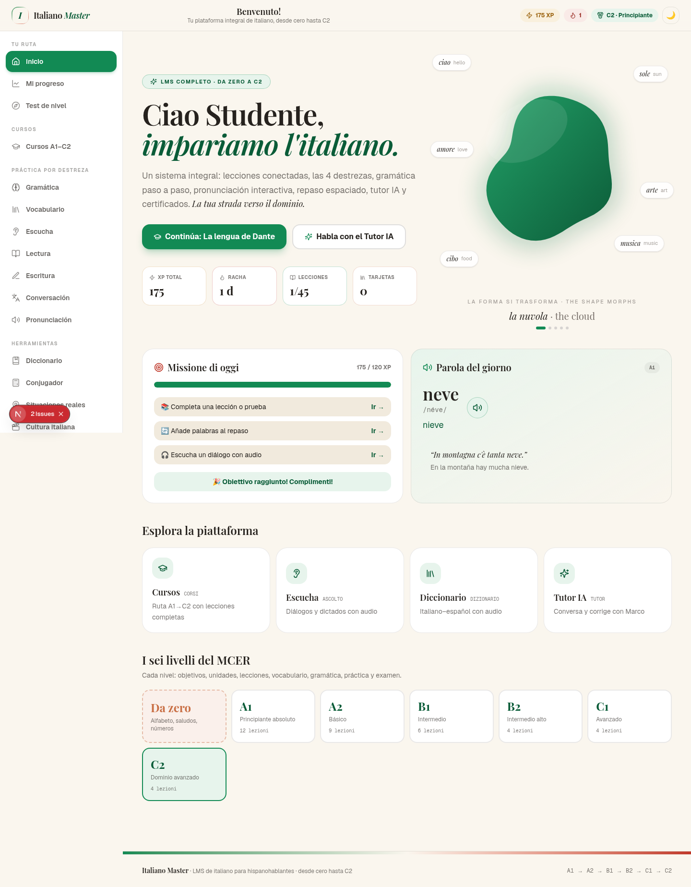
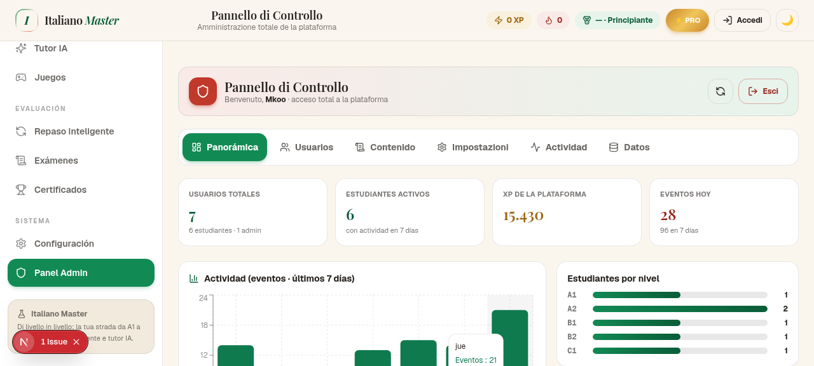

# 🇮🇹 Italiano Master

**🔗 Demo en vivo:** [italiano-master.vercel.app](https://italiano-master.vercel.app) · **Código:** [github.com/marcoskoo/italiano-master](https://github.com/marcoskoo/italiano-master)

**Plataforma interactiva de aprendizaje de italiano para hispanohablantes** — un LMS completo que va desde cero hasta el nivel C2 del MCER, con tutor de conversación, motor de ejercicios adaptativo, repetición espaciada (SRS) y un **panel de administración con control total de la plataforma**.


---

## ✨ Características

### 5 interacciones insignia
| Interacción | Dónde verla |
|---|---|
| 🌊 **Hero con forma en morfosis continua** (nuvola → stella → fiore → gemma → biscotto) | Portada (`Inicio`) |
| 🎯 **Vértices arrastrables con lecturas en vivo** — trapecio vocálico IPA con F1/F2, altura/apertura y % de coincidencia | `Pronunciación → Laboratorio de vocales` |
| 🎚️ **Gráficas controladas por deslizadores** — contorno de entonación + intensidad en tiempo real, y simulador de la curva del olvido | `Pronunciación → Estudio de entonación`, `Repaso inteligente` |
| 💚❤️ **Feedback de quiz con pulso de color** (verde correcto / rojo + shake incorrecto) | Motor de ejercicios en toda la app |
| 📜 **Soluciones paso a paso reveladas línea por línea** | `Gramática`, modelos de `Escritura` |
| 🏋️ **Rinforzo post-lección** (estilo Duolingo): quiz con vidas, escucha, pronunciación con micrófono y escritura — auto-generado del contenido de cada lección | Etapa 8 de cada lección: `Cursos → lección → Refuerzo` |

### LMS completo (21 secciones)
- **Niveles MCER A1 → C2 + modo «Desde cero»**: 7 cursos, **77 lecciones en 29 unidades** con pipeline completo *objetivos → explicación → ejemplos con audio → vocabulario → práctica → conversación → evaluación → **refuerzo***. Cada lección termina con un bloque de **rinforzo estilo Duolingo**: quiz con 3 vidas y barra de progreso, escucha TTS, pronunciación con reconocimiento de voz (Web Speech API, con autoevaluación de respaldo) y escritura breve con palabras obligatorias — todo generado automáticamente del vocabulario y ejemplos de la lección.
- **Las 4 destrezas**: Escucha (**14 tareas** con TTS y velocidades), Lectura (**14 textos graduados** con glosario), Escritura (**10 consignas** con corrección IA + modelo revelado), Conversación (**12 escenarios** de role-play con el tutor).
- **Vocabulario**: **31 categorías, ~280 palabras** con pronunciación, ejemplos, sinónimos/antónimos y flashcards SRS (algoritmo SM-2).
- **Gramática**: **30 temas A1→C2** con explicación en español y problemas resueltos paso a paso.
- **Herramientas**: Conjugador (~60 verbos, 7 tiempos, irregulares en rojo), Diccionario IT↔ES, **Numeri lab**, **Allenamento verbi**, **Analizzatore di frasi** y **Schede di estudio** (ver plugins).
- **Situaciones reales** (14: aeropuerto, hotel, restaurante, médico, farmacia, tren, objetos perdidos, gimnasio…), **Cultura italiana** (15 artículos), **Juegos** (memoria, ordenar frases, quiz relámpago, **impiccato**), **Test de nivel** (20 preguntas), **Exámenes** con certificados descargables.
- **Gamificación**: XP con rangos (Principiante → Gran Maestro), racha diaria, misiones, insignias.
- **Motor adaptativo**: los errores se registran por tema y generan «refuerzos dirigidos» y recomendaciones.
- **Planes FREE · PRO · PREMIUM · PLATINUM** con gating real de funciones y checkout demo.
- **Accesibilidad**: modo oscuro, 3 tamaños de letra, navegación por teclado, `prefers-reduced-motion`, responsive móvil.

### 🧩 Plugins y artefactos interactivos (v1.1)
| Plugin | Qué hace | Dónde |
|---|---|---|
| 🔢 **Numeri lab** | Conversor número→italiano (0–999.999.999) con ordinales, laboratorio de la hora (*e un quarto, meno un quarto, mezzogiorno*) y práctica con XP y comparación tolerante a acentos | Herramientas → Numeri lab |
| ⚡ **Allenamento verbi** | Drill de conjugación contrarreloj (60 s): ~57 verbos × 7 tiempos × 6 personas, rachas con bonus de XP, historial de formas y audio | Herramientas → Allenamento verbi |
| 📅 **Piano settimanale** | Generador de plan semanal personalizado: nivel × días × minutos → sesiones navegables con lecciones concretas, práctica por destreza, día de consolidación y examen final | Tu ruta → Piano settimanale |
| 🔬 **Analizzatore di frasi** | Pega una frase italiana y obtén el análisis palabra por palabra (traducción, formas verbales detectadas por índice inverso, nivel MCER estimado, cobertura) | Herramientas → Analizzatore |
| 🖨️ **Schede di studio** | Hojas imprimibles / PDF: vocabulario por categoría (con pronunciación y ejemplos), tablas de conjugación completas y chuleta de gramática (30 temas) | Herramientas → Schede |
| 🎯 **L'impiccato** | Ahorcado con las palabras del diccionario: teclado italiano (con vocales acentuadas), muñeco SVG progresivo, pistas opcionales y XP | Giochi → L'impiccato |

### 🛡️ Panel de administración (control total)
Accesible desde `Sistema → Panel Admin` o el botón «Accedi» del header:

- **Panorámica**: KPIs, actividad de 7 días, distribución por nivel/plan, top estudiantes, modo mantenimiento.
- **Usuarios**: CRUD completo (crear, editar XP/nivel/plan/racha, reset de contraseña, desactivar, eliminar). La cuenta `Mkoo` está protegida contra eliminación.
- **Contenido**: editor de vocabulario (palabras custom, ocultar/restaurar palabras base), lecciones (desactivar, crear lecciones custom con constructor de preguntas), ejercicios custom.
- **Impostazioni**: identidad de la app, mantenimiento con mensaje personalizado, activar/desactivar funciones (tutor, juegos, exámenes, planes, certificados, **Numeri lab, Allenamento verbi, Piano settimanale, Analizzatore, Schede**), niveles disponibles, defaults forzables, precios.
- **Actividad**: telemetría filtrable por tipo.
- **Datos**: export JSON completo, seed de datos demo, reset por zonas.

Los cambios de contenido y configuración se aplican **en caliente** a todos los clientes (hash de versión en el bundle público).

## 🔐 Credenciales

| Rol | Usuario | Contraseña |
|---|---|---|
| **Administrador** | `Mkoo` | `Mk/06612` |
| Estudiante demo | `giulia` · `carlos` · `lucia` · `diego` · `valentina` · `marco` | `italiano123` |

> ⚠️ Cambia la contraseña del admin en producción (edita el seed en `src/lib/admin/store.ts` o créala desde el panel tras el primer arranque).

## 🧱 Stack

- **Next.js 16** (App Router) · **TypeScript** · **Tailwind CSS 4** · **shadcn/ui** · **Zustand** (persistencia local) · **Recharts** · **Framer Motion**
- **TTS**: Web Speech API (`it-IT`)
- **Backend**: API Routes de Next.js con **almacenamiento portable sin base de datos externa** (ver abajo)
- **Tutor IA**: API compatible con OpenAI configurable por variables de entorno + fallback offline con respuestas guiadas

### 🗄️ Almacenamiento portable (sin Prisma)

El backend guarda usuarios, ajustes y telemetría en un **snapshot JSON** con tres backends automáticos, en este orden:

1. **Vercel Blob** (si existe `BLOB_READ_WRITE_TOKEN`) — duradero en producción. El snapshot viaja **cifrado AES-256-GCM** (la clave se deriva del token) y el blob es privado.
2. **Archivo local** `db/app-data.json` — desarrollo local.
3. **Memoria** — efímero (los datos se regeneran de la semilla en cada arranque en frío). El panel muestra el modo activo con un badge («Persistente · Vercel Blob / archivo local» o «Efímero · memoria»).

Con un almacén Blob conectado al proyecto de Vercel, **todos los cambios del panel admin persisten entre despliegues e instancias serverless**.

## 🚀 Desarrollo local

```bash
bun install        # o npm install
bun run dev        # o npm run dev → http://localhost:3000
```

No hay que configurar base de datos: en el primer arranque se siembran automáticamente el admin `Mkoo` y los estudiantes demo. Cualquier cambio queda en `db/app-data.json`.

## ▲ Despliegue en Vercel

### Opción 1 — un clic
[](https://vercel.com/new/clone?repository-url=https%3A%2F%2Fgithub.com%2Fmarcoskoo%2Fitaliano-master&project-name=italiano-master&repository-name=italiano-master)

### Opción 2 — CLI
```bash
npm i -g vercel
vercel          # preview
vercel --prod   # producción
```

### Persistencia (recomendado)
1. En el proyecto de Vercel: **Storage → Create Database → Blob**.
2. Conecta el store al proyecto — `BLOB_READ_WRITE_TOKEN` se inyecta automáticamente.
3. Redespliega. El panel mostrará «Persistente · Vercel Blob».

### Tutor IA en producción
El tutor funciona offline con respuestas guiadas. Para el tutor IA completo, añade en Vercel → Settings → Environment Variables:

| Variable | Descripción | Ejemplo |
|---|---|---|
| `TUTOR_API_BASE` | URL base de una API compatible con OpenAI | `https://api.openai.com/v1` |
| `TUTOR_API_KEY` | Clave de la API | `sk-...` |
| `TUTOR_MODEL` | Modelo (opcional, por defecto `gpt-4o-mini`) | `gpt-4o-mini` |

## 📁 Estructura

```
src/
├── app/
│   ├── api/                  # 14 API routes (auth, admin, tutor, config, telemetría)
│   ├── layout.tsx            # Fuentes, metadatos, tema
│   └── page.tsx              # SPA principal
├── components/
│   ├── italian/              # Las 5 interacciones insignia
│   ├── lms/                  # Shell + 21 vistas del LMS + panel admin
│   └── ui/                   # shadcn/ui
└── lib/
    ├── admin/                # store portable + helpers del servidor
    └── lms/                  # datos, SRS, motor adaptativo, planes, TTS…
```

## 📸 Capturas

| Portada | Panel Admin |
|---|---|
|  |  |

## 📄 Licencia

[MIT](LICENSE) © marcoskoo
